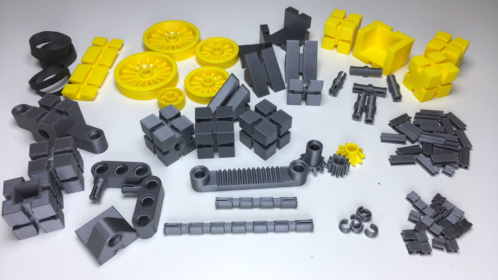
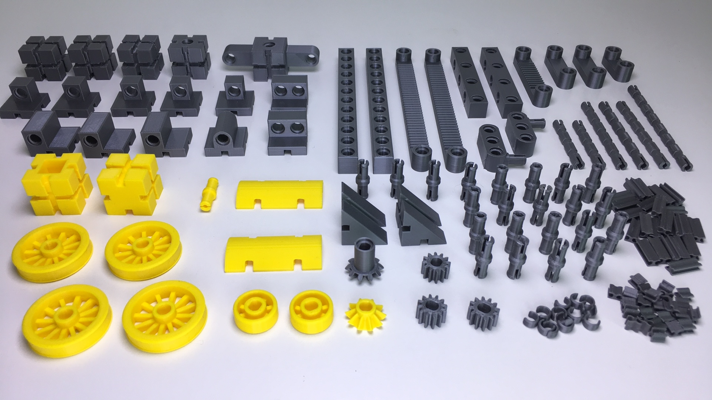

# kbricks models

**kbricks** (pronounced *"kay-bricks"*) is a fully 3d-printable, open source construction system. It allows for building stable models that don't fall into pieces when playing with them. kbricks parts can be printed with almost any state-of-the-art 3d printer.

This repository will contain growing collection of models that can be built from kbricks parts.

## tractor

The kbricks tractor has a functioning steering and can be used in combination with figures of common toy lines.

  

The tractor consists of 31 bricks, 53 connectors, and 6 axle rings shown on the following picture. Overall printing time has been some 20 hours on a [Prusa i3 MK3](https://en.wikipedia.org/wiki/Prusa_i3) 3d printer.

  

This [video](https://youtu.be/4aIxqMo3na0) shows how to assemble the kbricks tractor.

The required STL files can be downloaded from the [kbricks-core](https://github.com/kbricks/kbricks-core) repository.

## forklift

The kbricks forklift has a _functioning steering_, the _forklift unit can be tilted_, and the _fork can be moved up and down_. 

  

The forklift uses 32 types of parts shown on the following picture. Overall printing time has been some 30 hours on a [Prusa i3 MK3](https://en.wikipedia.org/wiki/Prusa_i3) 3d printer.

  

This [video](https://youtu.be/ZDeRqVcT2ME) shows how to assemble the kbricks forklift.

The required STL files can be downloaded from the [kbricks-core](https://github.com/kbricks/kbricks-core) repository.

## racing car

*Coming soon*

