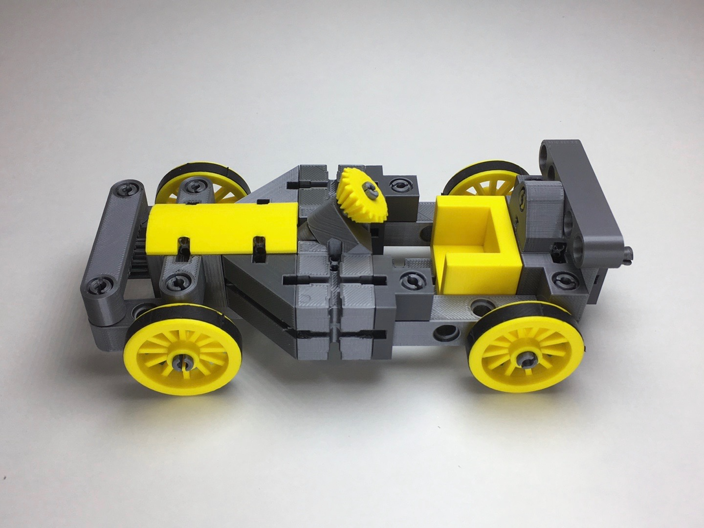

# kbricks models

**kbricks** (pronounced *"kay-bricks"*) is a fully 3d-printable, open source construction system. It allows for building stable models that don't fall into pieces when playing with them. kbricks parts can be printed with almost any state-of-the-art 3d printer.

This repository contains a growing collection of example models that can be built from kbricks parts. The following models are available so far:

|Description|Picture|
|-----------|-------|
|[Tractor with functioning steering.](tractor)| |
|[Forklift with a functioning steering and forklift unit.](forklift)| |
|[Racing car with a functioning steering.](racing_car)| |
|[Tipper truck with a functioning steering and tilt mechanism.](tipper_truck)| |
|[Toy gun to be used with loom rubber bands.](rubber_band_gun)| |
