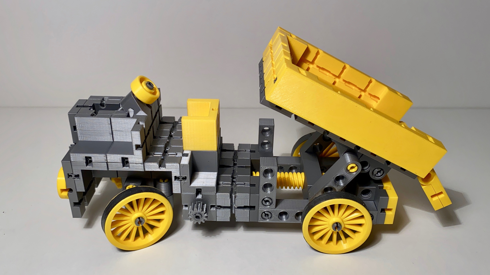

# kbricks models

**kbricks** (pronounced *"kay-bricks"*) is a fully 3d-printable, open source construction system. It allows for building stable models that don't fall into pieces when playing with them. kbricks parts can be printed with almost any state-of-the-art 3d printer.

This repository contains a growing collection of example models that can be built from kbricks parts. The following models are available so far:

|Model|Description|Picture|
|-----|-----------|-------|
|[kbricks tractor](tractor)|Tractor with functioning steering.| |
|[kbricks forklift](forklift)|Forklift with a functioning steering , a forklift unit that can be tilted, and a fork that can be moved up and down.| |
|[kbricks racing car](racing_car)|Racing car with a functioning steering.| |
|[kbricks tipper truck](tipper_truck)|Tipper truck with a functioning steering and tilt mechanism.| |
|[kbricks rubber band gun](rubber_band_gun)|Toy gun to be used with loom rubber bands.| |