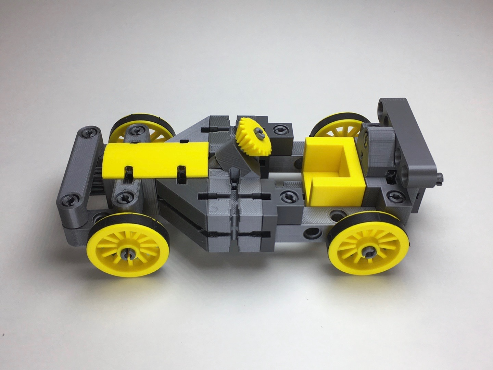
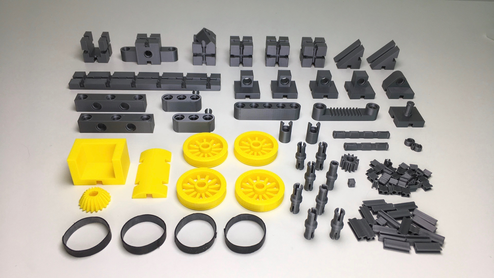

# kbricks racing car

## Overview
The kbricks racing car has a functioning steering and can be used in combination with figures of common toy lines.

  

## Printing instructions
The racing car subset of 26 bricks, 40 connectors, 8 pegs, and 9 axle rings shown on the picture. Overall printing time has been some 24 hours on a [Prusa i3 MK3](https://en.wikipedia.org/wiki/Prusa_i3) 3d printer.

  

Refer to the [kbricks construction system](https://github.com/kbricks/kbricks-core) for downloading and printing the parts and for hints on **_removing embedded support_**. The following list shows number of instances, recommended color, and specific print settings for each of the parts that is making up the model:

* 3 x cube_basic.stl (*silver*, *detect thin walls*)
* 1 x cube_u.stl (*silver*, *detect thin walls*)
* 1 x steering_column.stl (*silver*, *detect thin walls*)
* 1 x seat.stl (*yellow*, *detect thin walls*)
* 2 x prism_45deg.stl (*silver*)
* 25 x connector_long.stl (*silver*, *brim*)
* 30 x connector_short.stl (*silver*, *brim*)
* 9 x peg.stl (*silver*, *brim*)
* 6 x axle_ring.stl (*silver*)
* 4 x plate_1hole.stl (*silver*)
* 1 x plate_1hole_rounded.stl (*silver*)
* 1 x plate_peg.stl (*silver*)
* 1 x plate6x1.stl (*silver*)
* 1 x plate2x1_rounded.stl (*yellow*)
* 2 x beam3_peg_pos1.stl (*silver*, *support on build plate only*)
* 2 x beam5_alternating.stl (*silver*)
* 1 x beam5_rounded.stl (*silver*)
* 1 x axle4.stl (*silver*)
* 1 x axle3.stl (*silver*)
* 4 x spoke_wheel3_rim.stl (*yellow*)
* 1 x gear1.stl (*silver*)
* 1 x bevel_gear_60deg.stl (*yellow*)
* 1 x steering5.stl (*silver*)
* 1 x gear_rack5.stl (*silver*)
* 2 x cardan_joint.stl (*silver*)
* 1 x cardan_cube.stl (*silver*)

## Construction manual
This [video](https://youtu.be/gH02-JBFZsw) provides a step-by-step tutorial on how to assemble the kbricks racing car.

