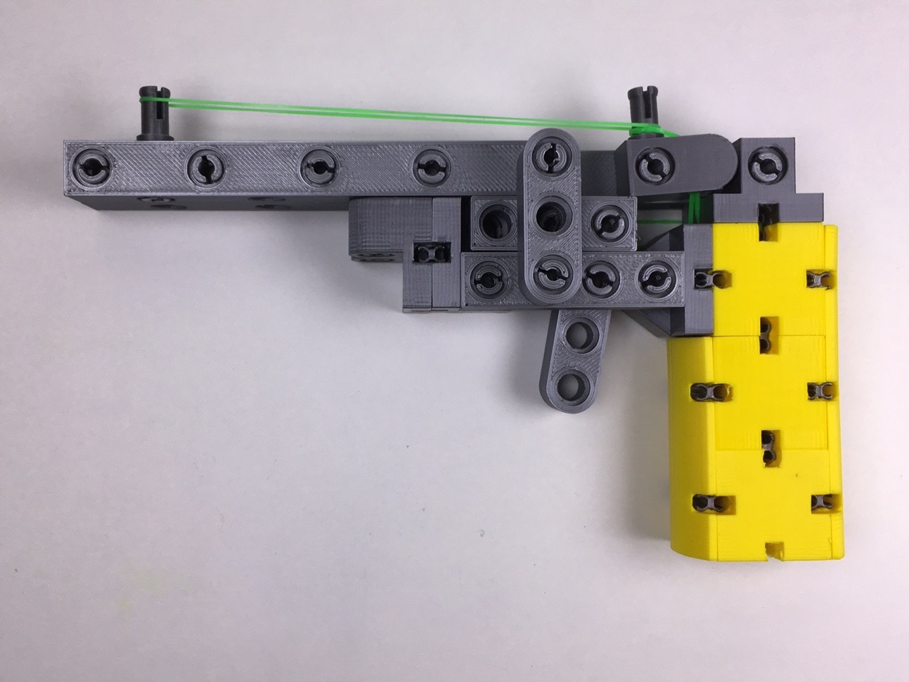

# kbricks rubber band gun

## Overview

I actually don't like weapons but I have no objections agains NERF and rubber guns. The kbricks rubber band gun is supposed to demonstrate that you cannot only build cars from kbricks parts.

  

## Printing instructions

The rubber band gun consists of  16 bricks and some 40 connectors and pegs shown in the picture.

  

Refer to the [kbricks construction system](https://github.com/kbricks/kbricks-core) for downloading and printing the parts and for hints on **_removing embedded support_**. The following list shows number of instances, recommended color, and specific print settings for each of the parts that is making up the model:

* 3 x cube_smooth.stl (*yellow*, *detect thin walls*)
* 1 x plate3x1_rounded.stl (*yellow*)
* 1 x plate2x1_rounded.stl (*yellow*)
* 1 x beam13_alternating.stl (*silver*)
* 1 x beam9_alternating.stl (*silver*)
* 1 x beam4.stl (*silver*)
* 1 x beam4_rounded.stl (*silver*)
* 1 x beam3.stl (*silver*)
* 1 x beam3_rounded.stl (*silver*)
* 1 x beam2_peg_pos2_alternating_semirounded.stl (*silver*, *support on build plate only*)
* 1 x plate_2hole.stl (*silver*)
* 1 x plate_2hole_rounded.stl (*silver*)
* 1 x plate_1hole.stl (*silver*)
* 1 x plate_1hole_rounded.stl (*silver*)
* 12 x connector_long.stl (*silver*, *brim*)
* 12 x connector_short.stl (*silver*, *brim*)
* 16 x peg.stl (*silver*, *brim*)

## Construction manual

This [video](https://youtu.be/jxEc-kjTads) provides a step-by-step tutorial on how to assemble the kbricks rubber band gun.

