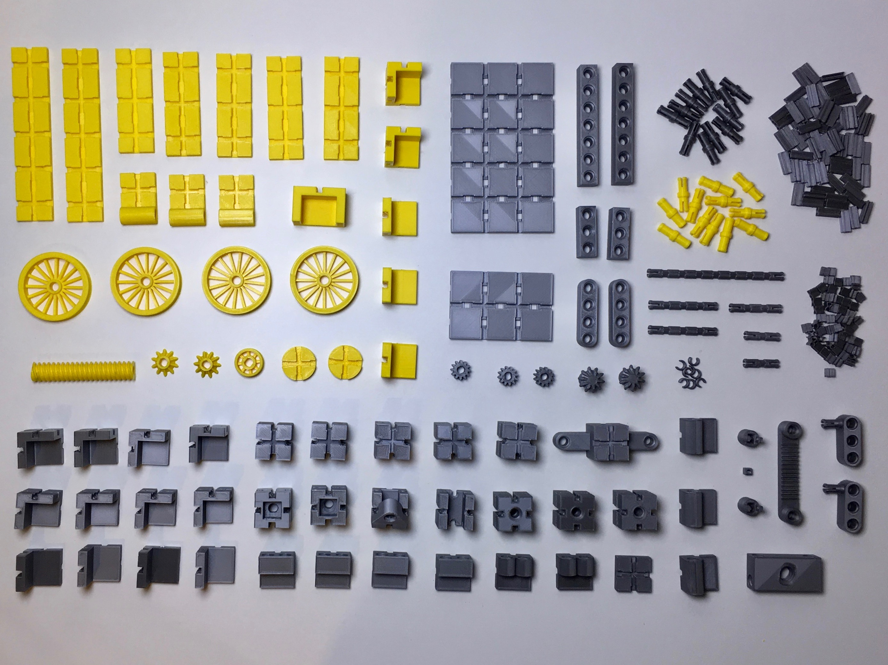

# kbricks tipper truck

## Overview
The kbricks tipper truck has a functioning steering and tilt mechanism and can be used in combination with figures of common toy lines.

  

## Printing instructions
The tipper truck subset of 43 different bricks plus a number of connectors, pegs, and axle rings shown on the  picture.

  

Refer to the [kbricks construction system](https://github.com/kbricks/kbricks-core) for downloading and printing the parts and for hints on **_removing embedded support_**. The following list shows number of instances, recommended color, and specific print settings for each of the parts that is making up the model:

* 2 x plate5x1.stl (*yellow*)
* 5 x plate3x1.stl (*yellow*)
* 3 x plate_hinged.stl (*yellow*)
* 2 x disk.stl (*yellow*)
* 4 x spoke_wheel4_rim.stl (*yellow*)
* 1 x spoke_wheel2_locked.stl (*yellow*)
* 2 x bevel_gear_90deg_short.stl (*yellow*)
* 2 x cube_corner.stl (*yellow*, *detect thin walls*)
* 3 x cube_l.stl (*yellow*, *detect thin walls*)
* 1 x seat.stl (*yellow*, *detect thin walls*)
* 1 x worm6.stl (*yellow*, *brim*)
* 16 x peg.stl (*yellow*, *brim*)
* 1 x plate5x3_twosided.stl (*silver*)
* 1 x plate3x2_twosided.stl (*silver*)
* 1 x plate1x1.stl (*silver*)
* 4 x plate_2hole.stl (*silver*)
* 2 x plate_2hole_rounded.stl (*silver*)
* 3 x plate_2hole_rounded_inline.stl (*silver*)
* 2 x bevel_gear_90deg.stl (*silver*)
* 3 x gear1.stl (*silver*)
* 1 x gear_rack6.stl (*silver*)
* 2 x cardan_joint_thick.stl (*silver*)
* 1 x cardan_cube.stl (*silver*)
* 1 x axle8.stl (*silver*)
* 2 x axle4.stl (*silver*)
* 1 x axle3.stl (*silver*)
* 2 x axle2.stl (*silver*)
* 2 x beam7.stl (*silver*)
* 2 x beam3.stl (*silver*)
* 2 x beam4_rounded.stl (*silver*)
* 1 x worm_block.stl (*silver*)
* 1 x steering6.stl (*silver*)
* 5 x cube_basic.stl (*silver*, *detect thin walls*)
* 8 x cube_corner.stl (*silver*, *detect thin walls*)
* 4 x cube_l.stl (*silver*, *detect thin walls*)
* 1 x cube_u.stl (*silver*, *detect thin walls*)
* 1 x cube_1hole_open.stl (*silver*, *detect thin walls*)
* 1 x cube_2open.stl (*silver*, *detect thin walls*)
* 1 x cube_1hole.stl (*silver*, *detect thin walls*)
* 2 x cube_2hole.stl (*silver*, *detect thin walls*)
* 1 x steering_column.stl (*silver*, *detect thin walls*)
* 2 x beam3_peg_pos1.stl (*silver*, *support on build plate only*)
* 40 x connector_long.stl (*silver*, *brim*)
* 80 x connector_short.stl (*silver*, *brim*)
* 16 x peg.stl (*silver*, *brim*)
* 10 x axle_ring.stl (*silver*)

## Construction manual
This [video](https://youtu.be/_zE2k9IcISQ) provides a step-by-step tutorial on how to assemble the kbricks tipper truck.